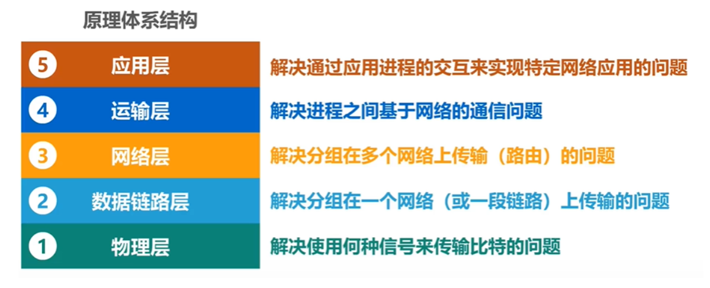
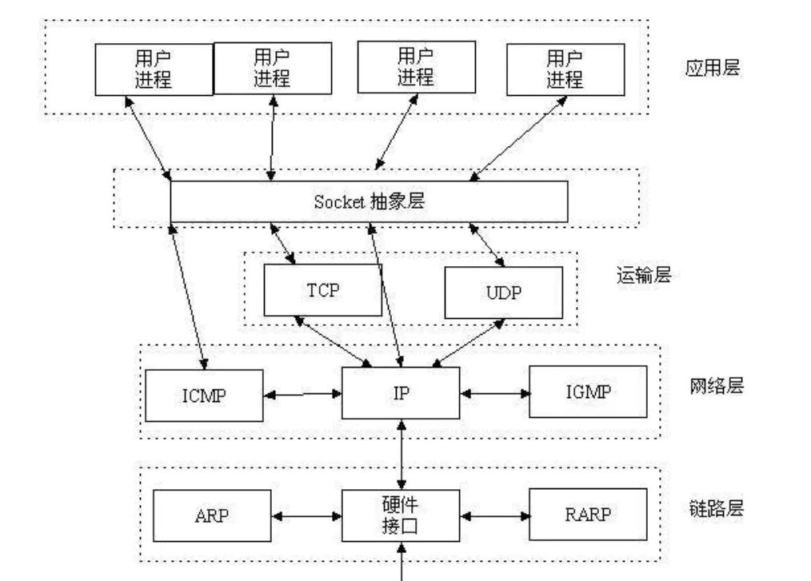
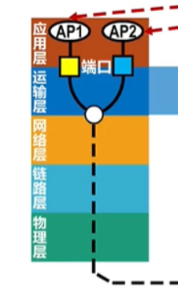
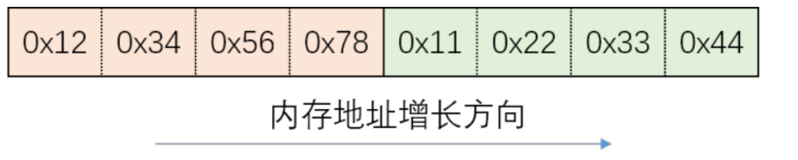
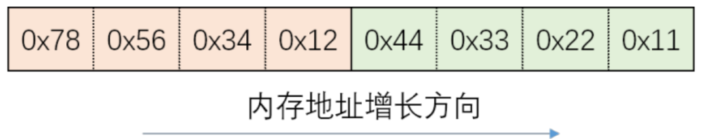
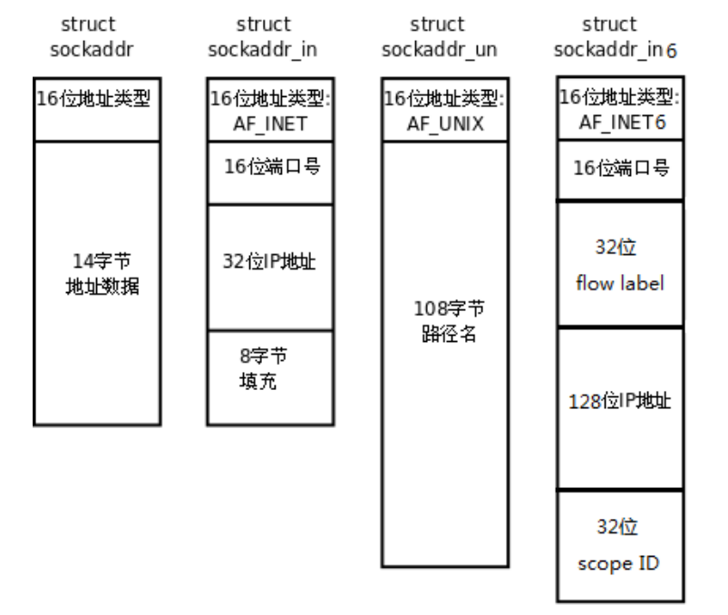
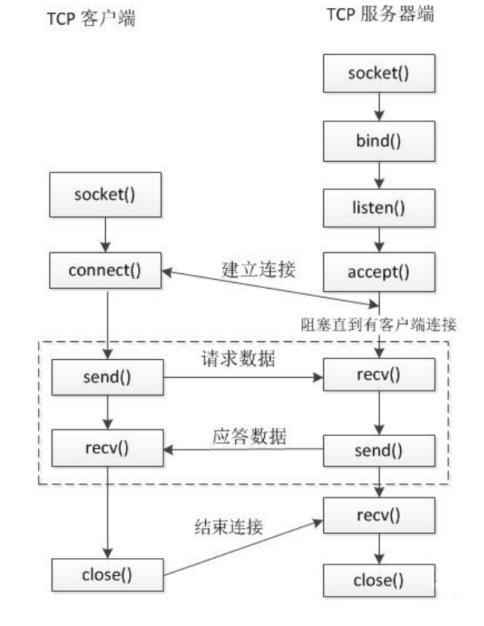

# SOCKET

## 理念：运输层接口

网络体系结构：



在五层网络结构中，最上层是应用层，完成应用程序的具体逻辑；下面四层，都是网络传输控制协议。一般情况下，我们并不需要陷入四层复杂的网络协议过程：下面四层向应用层提供了socket接口。

应用层进程只需要使用socket接口简单设置IP与port（端口），就可以像读写文件一样，使用网络进行通讯。



> 遵循IP协议，主机之间可以发送数据报。IP地址是互联网上每个主机的逻辑地址。数据报头中含有目标IP地址和源IP地址，由此计算机可以在网络中通信。

> “端口” 是英文 port 的意译，可以认为是设备与外界通讯交流的出口。端口可分为虚拟端口和物理端口，其中虚拟端口指计算机内部或交换机路由器内的端口，不可见，是特指TCP/IP协议中的端口，是逻辑意义上的端口。例如计算机中的 80 端口、21 端口、23 端口等。物理端口又称为接口，是可见端口，计算机背板的 RJ45 网口，交换机路由器集线器等 RJ45 端口。电话使用 RJ11 插 口也属于物理端口的范畴。
>
>  **如果把 IP 地址比作一间房子，端口就是出入这间房子的门。**真正的房子只有几个门，但是一个 IP 地址的端口可以有 65536（即：2^16）个之多！端口是通过端口号来标记的，端口号只有整数， 范围是从 0 到65535（2^16-1）。
>
> 
>
> 不同应用程序使用同一个ip地址的不同port

## 数据结构

### 字节序问题

#### 大端序(网络序)：数字的高位在低地址

网络传输规定是大端序

下面的数字在大端序下是：0x 12 34 56 78 11 22 33 44



#### 小端序（大多数设备）：数字的高位在高地址

下面的数字在小端序下是：0x 11 22 33 44 12 34 56 78



#### 字节序转换函数

为了方便，BSD socket给了一组网络序与主机序的数字转换关系。（你也不需要自己查看自己主机的序情况了）

函数名中具体字母解释：

```
h - host 主机，主机字节序
to - 转换成什么
n - network 网络字节序
s - short unsigned short
l - long unsigned int
```

函数：host to network long

```c
#include <arpa/inet.h>
// 短整数转换，常用于转换端口号
uint16_t htons(uint16_t hostshort); // 主机字节序 - 网络字节序
uint16_t ntohs(uint16_t netshort); // 主机字节序 - 网络字节序
// 长整数转换，常用于转换IP地址
uint32_t htonl(uint32_t hostlong); // 主机字节序 - 网络字节序
uint32_t ntohl(uint32_t netlong); // 主机字节序 - 网络字节序
```

### IPv4地址：字符串整数转换

有人更喜欢用点分十进制字符串写标识IPv4地址，计算机则使用32位整数。下面的函数提供了格式转换方式：

```c
#include <arpa/inet.h>
// p:点分十进制的IP字符串，n:表示network，网络字节序的整数
int inet_pton(int af, const char *src, void *dst);
    af:地址族： AF_INET AF_INET6
    src:需要转换的点分十进制的IP字符串
    dst:转换后的结果保存在这个里面
        
// 将网络字节序的整数，转换成点分十进制的IP地址字符串
const char *inet_ntop(int af, const void *src, char *dst, socklen_t size);
    af:地址族： AF_INET AF_INET6
    src: 要转换的ip的整数的地址
    dst: 转换成IP地址字符串保存的地方
    size：第三个参数的大小（数组的大小）
    返回值：返回转换后的数据的地址（字符串），和 dst 是一样的
```

`void *`，一般就是一个32位无符号整数的地址：

```c
typedef unsigned int uint32_t;
typedef uint32_t in_addr_t;
```

### socket地址结构体

使用socket时，需要给下层传递ip地址（网络层地址）和端口号（运输层），这通过一个结构体实现。

早期通用socket结构体格式：

```c
#include <bits/socket.h>
struct sockaddr {
    sa_family_t sa_family;
    char sa_data[14];
};
typedef unsigned short int sa_family_t
```

但是，有些新的编址模式（如IPv6）需要更大的空间。于是有了这个新的通用socket‘结构体：

```c
#include <bits/socket.h>
struct sockaddr_storage
{
    sa_family_t sa_family;
    unsigned long int __ss_align;
    char __ss_padding[ 128 - sizeof(__ss_align) ];
};
typedef unsigned short int sa_family_t;

```

为支持不同的网络协议，socket结构体有一个地址族类型`sa_family_t`变量`sa_family`，用于标识。

地址族类型通常与协议族类型对应。常见的协议族（protocol family，也称 **domain**）和对应的地址族入下所示：

| 协议族   | 地址族   | 描述           |
| -------- | -------- | -------------- |
| PF_UNIX  | AF_UNIX  | UNIX本地协议族 |
| PF_INET  | AF_INET  | TCP/IPv4协议族 |
| PF_INET6 | AF_INET6 | TCP/IPv6协议族 |

宏 PF\_\* 和 AF\_\* 都定义在 bits/socket.h 头文件中，且后者与前者有完全相同的值，所以二者通常混用。

sa_data 成员用于存放 socket 地址值。但是，不同的协议族的地址值具有不同的含义和长度。

**通用结构体只是一种标识。所有专用 socket 地址（以及 sockaddr_storage）类型的变量在实际使用时都需要转化为通用 socket 地 址类型 sockaddr（强制转化即可），因为所有 socket 编程接口为向前兼容，使用的地址参数类型都是 sockaddr。**

不同网络协议的sock结构体具体如下：

```c
#include <netinet/in.h>

//IPv4协议 sock结构体
struct sockaddr_in
{
    sa_family_t sin_family; /* __SOCKADDR_COMMON(sin_) */ /*协议类型*/
    in_port_t sin_port; /* Port number. */
    struct in_addr sin_addr; /* Internet address. */
    /* Pad to size of `struct sockaddr'. 内存填充*/
    unsigned char sin_zero[sizeof (struct sockaddr) - __SOCKADDR_COMMON_SIZE -sizeof (in_port_t) - sizeof (struct in_addr)];
};
struct in_addr
{
    in_addr_t s_addr;
};
typedef unsigned short uint16_t;
typedef unsigned int uint32_t;
typedef uint32_t in_addr_t;
typedef uint16_t in_port_t;

//IPv4协议 sock结构体
struct sockaddr_in6
{
sa_family_t sin6_family;
in_port_t sin6_port; /* Transport layer port # */
uint32_t sin6_flowinfo; /* IPv6 flow information */
struct in6_addr sin6_addr; /* IPv6 address */
uint32_t sin6_scope_id; /* IPv6 scope-id */
};

//本地Unix套接字
#include <sys/un.h>
struct sockaddr_un
{
    sa_family_t sin_family;
    char sun_path[108];
};

#define __SOCKADDR_COMMON_SIZE (sizeof (unsigned short int))

```



### 综合演示

```c
#include <arpa/inet.h>
#include <stdio.h>

int main()
{
    printf("===字节序演示===\n");

    union 
    {
        short value;
        char bytes[sizeof(short)];
    }test;

    test.value = 0x0102;  //十六进制数

    if(test.bytes[0] == 1){
        printf("本地是大端序\n");
    }else if(test.bytes[0]==2){
        printf("本地是小端序\n");
    }

    unsigned int num0 = 0x11223344;
    printf("本地num = 0x%x\n",num0);
    unsigned int num1 = htonl(num0);  //host to network (long 32 bit)
    printf("网络模式：num = 0x%x\n",num1);

    printf("\n===IP字符串转数字===\n");

    char buf[] = "192.168.1.4";

    unsigned int num = 0;

    inet_pton(AF_INET, buf, &num);//字符串转数字
    unsigned char * p1 = (unsigned char *)&num;
    printf("%d %d %d %d\n", *p1, *(p1+1), *(p1+2), *(p1+3));//大端序所以是数字高位在低地址

    char ip[16];

    const char * str = inet_ntop(AF_INET, &num, ip, 16);
    printf("str : %s\n",str);
    printf("ip : %s\n",ip);
    printf("%d\n", ip==str);

    printf("\n===sock结构体演示===\n");

    struct sockaddr_in sock; //IPv4 结构体

    sock.sin_family = AF_INET; //网络类型是IPv4协议族
    inet_pton(AF_INET, "127.0.0.1",&sock.sin_addr.s_addr);//字符串类型地址转数字
    sock.sin_port = htons(0x4321); //端口需转换成网络序
    printf("port : 0x%x\n",sock.sin_port);
    
    return 0;
}
```

## 使用socket进行TCP通信

TCP是运输层可靠传输协议。三次握手建立TCP连接后，两台联网主机可以可靠地发送信息。

使用socket编程时，并不需要知道TCP协议的内容是什么，只需要使用接口调用TCP协议。



来看看怎么做吧：

### 服务器端

To accept connections, the following steps are performed:

服务器端需要做以下几步：

1. A socket is created with socket(2).      

   使用`socket()`函数创建一个socket文件描述符sockfd。

2. The socket is bound to a local address using bind(2), so that other sockets may be  connect(2)ed to it.   

   使用`bind()`函数，将本地的某个IP地址、某个端口，与sockfd绑定。

3. A  willingness  to  accept  incoming  connections and a queue limit for incoming connections are specified with listen().

   使用`listen()`函数，将sockfd从一个主动socket（active socket）转化为一个监听socket（passive socket），同时设置一个等待连接客户端序列的最大值。

4. Connections are accepted with accept(2).

   使用`accept()`函数，阻塞地等待一个客户端连接。会返回一个已连接文件描述符（connected descriptor），可以用这个描述符，进行Unix I/O（文件读写）

下面具体讲接口：

```c
#include <sys/types.h>
#include <sys/socket.h>
#include <arpa/inet.h> // 包含了这个头文件，上面两个就可以省略
int socket(int domain, int type, int protocol);
  - 功能：创建一个socket
  - 参数：
    - domain: 协议族
      AF_INET : ipv4
      AF_INET6 : ipv6
      AF_UNIX, AF_LOCAL : 本地套接字通信（进程间通信）
    - type: 通信过程中使用的协议类型
      SOCK_STREAM : 流式协议
      SOCK_DGRAM : 报式协议
    - protocol : 具体的一个协议。一般写0
      - SOCK_STREAM : 流式协议默认使用 TCP
      - SOCK_DGRAM :  报式协议默认使用 UDP
  - 返回值：
    - 成功：返回文件描述符sockfd，操作的就是内核缓冲区。
    - 失败：-1

//bind之前，需要预先初始化sockaddr，内容为协议类型，服务器IP和端口号
int bind(int sockfd, const struct sockaddr *addr, socklen_t addrlen); 
  - 功能：绑定，将fd 和本地的IP + 端口进行绑定
  - 参数：
    - sockfd : 通过socket函数得到的文件描述符
    - addr : 需要绑定的socket地址，这个地址的结构体封装了ip和端口号的信息（可以使用各种socket结构体）
    - addrlen : 第二个参数结构体占的内存大小
        
int listen(int sockfd, int backlog); // /proc/sys/net/core/somaxconn
  - 功能：将sockfd从一个主动socket（active socket）转化为一个监听socket（passive socket），同时设置一个等待连接客户端序列的最大值。
  - 参数：
    - sockfd : 通过socket()函数得到的文件描述符
    - backlog : 未连接的和已经连接的和的最大值， < /proc/sys/net/core/somaxconn
  - 返回值：
    - 成功 0：用于通信的文件描述符
    - 失败-1 ： errno被设置

//accept之前要准备空间sockaddr，和addrlen，存协议类型，客户端的ip，端口，结构体长度
int accept(int sockfd, struct sockaddr *addr, socklen_t *addrlen);
  - 功能：接收客户端连接，默认是一个阻塞的函数，阻塞等待客户端连接
  - 参数：
    - sockfd : 用于监听的文件描述符
    - addr : 传出参数，记录了连接成功后客户端的地址信息（ip，port）
    - addrlen : 指定第二个参数的对应的内存大小
  - 返回值：
    - 成功 ：用于通信的文件描述符
    - -1 ： 失败
        
ssize_t write(int fd, const void *buf, size_t count); // 写数据
ssize_t read(int fd, void *buf, size_t count); // 读数据
```

### 客户端

客户端主动连接服务器需要进行的操作：

1. 使用`socket()`函数创建一个socket文件描述符sockfd。

2. 使用`connect()`函数建立进而服务器的连接。

```c
#include <sys/types.h>
#include <sys/socket.h>
#include <arpa/inet.h> // 包含了这个头文件，上面两个就可以省略
int socket(int domain, int type, int protocol);
  - 功能：创建一个socket
  - 参数：
    - domain: 协议族
      AF_INET : ipv4
      AF_INET6 : ipv6
      AF_UNIX, AF_LOCAL : 本地套接字通信（进程间通信）
    - type: 通信过程中使用的协议类型
      SOCK_STREAM : 流式协议
      SOCK_DGRAM : 报式协议
    - protocol : 具体的一个协议。一般写0
      - SOCK_STREAM : 流式协议默认使用 TCP
      - SOCK_DGRAM :  报式协议默认使用 UDP
  - 返回值：
    - 成功：返回文件描述符sockfd，操作的就是内核缓冲区。
    - 失败：-1

//connect之前要准备好客户端要连接的服务器的地址信息addr
int connect(int sockfd, const struct sockaddr *addr, socklen_t addrlen);
  - 功能： 客户端连接服务器
  - 参数：
    - sockfd : 用于通信的文件描述符
    - addr : 客户端要连接的服务器的地址信息
    - addrlen : 第二个参数的内存大小
    - 返回值：成功 0， 失败 -1
    
ssize_t write(int fd, const void *buf, size_t count); // 写数据
ssize_t read(int fd, void *buf, size_t count); // 读数据
```

### 综合演示

多进程服务器。（我没有写回收僵尸进程嘿嘿

服务器功能：发给服务器什么服务器就会发回来什么。

```c
//server.c
#include <stdio.h>
#include <arpa/inet.h>
#include <unistd.h>
#include <string.h>
#include <stdlib.h>

void job(int cfd)
{
    char buf[1024];
    while (1)
    {
        bzero(buf, 1024);
        int len = read(cfd, buf, sizeof(buf));
        if(len<=0){
            break;
        }
        printf("recv from client : %s",buf);
        write(cfd,buf,strlen(buf));
    }
    printf("client closed...\n");
    close(cfd);
}

int main()
{
    //socket
    int lfd = socket(AF_INET, SOCK_STREAM,0);

    //bind
    struct sockaddr_in sa;
    sa.sin_family = AF_INET;
    sa.sin_port = htons(9999);
    sa.sin_addr.s_addr = INADDR_ANY;
    bind(lfd, (struct sockaddr *)&sa, sizeof(sa));

    //listen
    listen(lfd, 128);

    while (1)
    {
        //accept
        struct sockaddr_in ca;
        int lll;
        int cfd = accept(lfd, (struct sockaddr *)&ca, &lll);
        char IP[16];
        inet_ntop(AF_INET, &ca.sin_addr.s_addr, IP, sizeof(IP));
        printf("client ip is %s, port is %d\n",IP, ntohs(ca.sin_port));

        //multi process server
        if(fork()== 0){
            job(cfd);
            exit(0);
        }
    }
    return 0;
}
```

```c
//client.c
#include <stdio.h>
#include <arpa/inet.h>
#include <unistd.h>
#include <string.h>
#include <stdlib.h>

void job(int fd)
{
    char buf[1024];
    while (1)
    {
        bzero(buf, 1024);
        fgets(buf,1024,stdin); 
        write(fd,buf,strlen(buf));
        int len = read(fd, buf, sizeof(buf));
        if(len<=0){
            break;
        }
        printf("recv from server : %s",buf);
    }
    printf("server closed...\n");
    close(fd);
}

int main()
{
    //socket
    int fd = socket(AF_INET, SOCK_STREAM, 0);

    //bind
    struct sockaddr_in sa;
    sa.sin_family = AF_INET;
    inet_pton(AF_INET, "127.0.0.1", &sa.sin_addr.s_addr);
    sa.sin_port = htons(9999);
    connect(fd,(struct sockaddr *)&sa,sizeof(sa));
    job(fd);

    return 0;
}
```

演示：

```c
//client端
zhuansunyuxiang@entry-of-plct:~/trainning/atest/socket$ ./client
哥们在这给你说唱
recv from server : 哥们在这给你说唱
哥们名叫丁真
recv from server : 哥们名叫丁真
    
//server端：
zhuansunyuxiang@entry-of-plct:~/trainning/atest/socket$ ./server
client ip is 152.127.0.0, port is 25704
recv from client : 哥们在这给你说唱
recv from client : 哥们名叫丁真
client closed...
   
```

